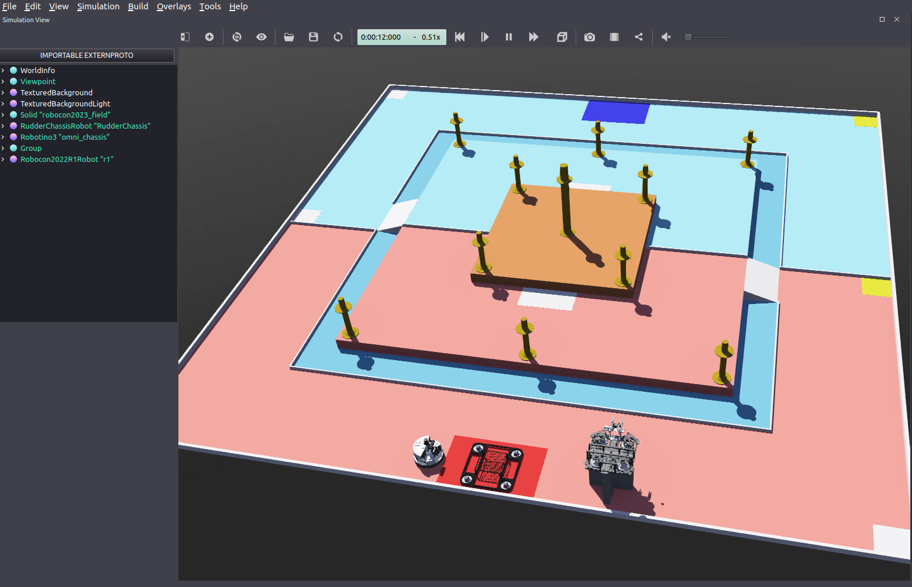

# Introduction

This project is developed based on the webots_ros offical repo with some necessary customizations for the BUPT robot team's chassis and visual algorithms simulation.

# Features:star2:

- [x] Robocon 2023 field with 1:1 size and collision property.

- [x] Robocon 2022 R1 robot of BUPT (steer wheel chassis with a 2 DoF gripper) in [PROTO](https://www.cyberbotics.com/doc/reference/proto#!) format. The [URDF](http://wiki.ros.org/urdf) file for robot are also completed for further usage (rviz visualization, kinematics, etc.).

- [ ] Localization based on GPS and Compass

# Getting started:rocket:

- Install Webots
  
  > For better compatibility, this project is developed based on **Ubuntu 20.04** and **ROS Noetic**. We assume that you have already installed ROS on your computer.

- Clone and build this repo
  
  > If you haven't installed catkin-tools, install it first:
  > 
  > ```shell
  > sudo apt install python3-catkin-tools
  > ```
  
  ```shell
  # cd to your <ros_workspace>/src and then
  git clone https://gitee.com/SimonKenneth/bupt_webots.git
  catkin build bupt_webots
  source ../devel/setup.bash
  ```

- launch the simulator
  
  ```shell
  roslaunch bupt_webots robocon2023.launch
  ```
  
  Then you will see field and robot is loaded correctly if god bless you 😂.
  
  

- Control the motors in Webots
  
  - Using ROS services
    
    For example:
    
    ```shell
    rosservice call /r1/wheel1_drive_joint/set_velocity  "value: 1.0"
    ```
    
    You can create corresponding service clients in your cpp or python nodes which are usually related to kinematics resolving.
  
  - Using `ros_control`
    
    This project has completed `ros_control` config for Robocon2022 R1 robot. You can simply publish control commands to corresponding topics. For example:
    
    ```python
    import rospy
    from std_msgs.msg import Float64MultiArray
    rospy.init_node("drive_vel_pub_test")
    drive_wheel_vel_pub = rospy.Publisher(
    "/r1/wheel_drive_velocity_controller/command",
    Float64MultiArray,
    queue_size=1)
    cmd_vel = Float64MultiArray([1,1,1,1])
    drive_wheel_vel_pub.publish(cmd_vel)
    ```

Enjoy!:smiling_face_with_three_hearts:

# Develop:wrench:

We strongly recommend you reading the following materials to learn about webots_ros:

- https://www.cyberbotics.com/doc/guide/using-ros
- https://www.cyberbotics.com/doc/reference/ros-api
- [https://www.cyberbotics.com/doc/reference/proto](https://www.cyberbotics.com/doc/reference/proto)

**TODO**